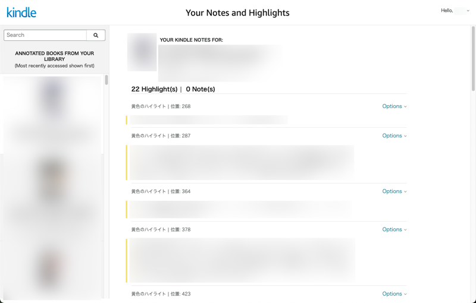
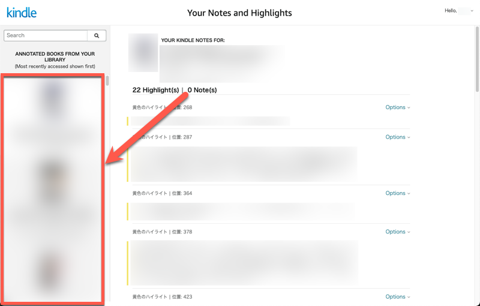
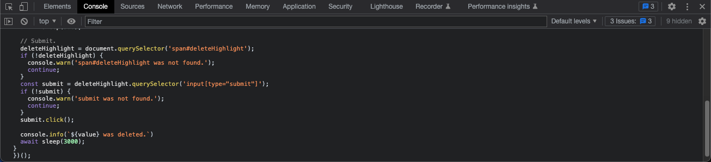

# Kindle highlight deleter
Ad hoc JavaScript to delete Kindle highlights from Kindle "Your Notes and Highlights".

## Usage
Open "Your Notes and Highlights"<br/>
https://read.amazon.com/notebook

Note that you should select the appropriate site corresponding to your language. (amazon.co.jp, amazon.com, etc.).



---

Select a book in which you want to delete highlights.



---

Open "Developer Tools" of your browser.<br/>
In Google Chrome, you can open it with F12.

---

Paste the following JavaScript in the console tab and press ENTER.



```javascript
const sleep = ms => new Promise(resolve => setTimeout(resolve, ms));

(async () => {
const options = document.querySelector('#kp-notebook-annotations').querySelectorAll('div.a-row .a-spacing-base');
const triggers = Array.from(options || [])
  .map(option => option.querySelector('a.a-popover-trigger'))
  .filter(Boolean);

for (const trigger of triggers) {
  // Show a popup menu.
  trigger.click();
  await sleep(500);

  // Click a "delete highlight" item.
  let deleteHighlight = document.querySelector('a#deletehighlight');
  if (!deleteHighlight) {
    console.warn('a#deletehighlight was not found.');
    continue;
  }
  const value = deleteHighlight.attributes.getNamedItem('value').value;
  deleteHighlight.click();
  await sleep(500);

  // Submit.
  deleteHighlight = document.querySelector('span#deleteHighlight');
  if (!deleteHighlight) {
    console.warn('span#deleteHighlight was not found.');
    continue;
  }
  const submit = deleteHighlight.querySelector('input[type="submit"]');
  if (!submit) {
    console.warn('submit was not found.');
    continue;
  }
  submit.click();

  console.info(`${value} was deleted.`)
  await sleep(3000);
}
})();
```
